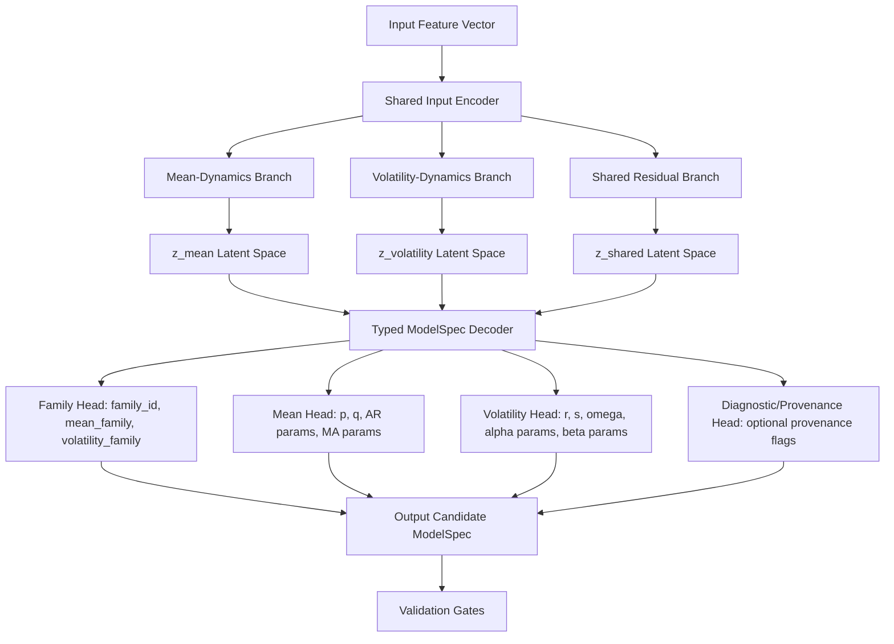

# Factorized Constrained VAE Architecture Specification

This document defines the strict, canonical architecture specification for the first neural model candidate: **Factorized Constrained VAE** (short alias: **FC-VAE**), equipped with a typed `ModelSpec` decoder. 

## 1. Purpose

The Factorized Constrained VAE exists to address and test the core Phase 2 research question:
> Can a constrained / rule-aware / compositional latent generative model trained only on structurally different time-series families A and B generate valid unseen structural type C?

Where:
- **Family A**: AR/ARMA mean-dynamics family (constant/zero volatility).
- **Family B**: GARCH volatility-dynamics family (zero/constant mean).
- **Family C**: ARMA-GARCH composite family (both mean-dynamics and volatility-dynamics active simultaneously).

Generating raw curve sequences (floating-point arrays) is insufficient because raw curves do not preserve or enforce the mathematical constraints, order properties, and structural parameters of the underlying model specifications. The generative model must instead operate directly in the parameter and specification domain, proposing typed model candidate structures.

---

## 2. Canonical Architecture

### Input Representation
- **Preferred v0 Input**: A compact structural and diagnostic feature vector derived deterministically from accepted time-series samples. This input is artifact-backed and deterministic, representing computed statistical features (e.g. autocorrelation, partial autocorrelation, variance, and volatility diagnostics) rather than raw infinite-length curves.
- **Alternative Future Input**: A raw standardized time-series encoder. (Not implemented in P24).

### Encoder
The network splits input features into factorized streams via:
1. **Shared Input Encoder**: Extends features into a shared representation.
2. **Mean-Dynamics Branch**: Extracts mean dynamic patterns.
3. **Volatility-Dynamics Branch**: Extracts volatility dynamic patterns.
4. **Shared Residual Branch**: Captures general statistical properties.

### Latent Partition
The latent space is explicitly partitioned into three independent components:
- `z_mean`: Captures the latent representation of mean-dynamics.
- `z_volatility`: Captures the latent representation of volatility-dynamics.
- `z_shared`: Captures shared factors and residual variation.

### Decoder
Reconstructs latent samples into structured specification parameters via four heads:
1. **Family Head**: Outputs classifications for `family_id`, `mean_family`, and `volatility_family`.
2. **Mean Head**: Outputs integer orders `p` and `q`, along with AR and MA parameter coefficients.
3. **Volatility Head**: Outputs integer orders `r` and `s`, along with coefficients for `omega`, `alpha`, and `beta`.
4. **Diagnostic/Provenance Head**: Outputs optional future provenance flags. To avoid hidden defaults, all flags must be explicitly initialized.

### Typed Boundary
The decoder outputs must be parsed and mapped into an in-memory `ModelSpec` structure. Every candidate `ModelSpec` must pass:
- `validate_model_spec`
- `require_math_valid`

Invalid outputs that fail to form a valid spec or violate math validity constraints must be counted to honestly report model validity rates, rather than being silently repaired or projected, unless a future explicit projection contract is defined.

---

## 3. Constraint Handling Modes

Three modes are specified for future implementation:
1. **reject-invalid mode (Recommended for v0)**: Any generated spec failing schema or math validation is discarded and counted as invalid. This ensures honest validity accounting, avoids silent repair, and provides a clear, un-manipulated baseline of generative capability.
2. **Projection Mode**: Invalid parameter configurations are mapped to the nearest mathematically valid point on the boundary (e.g., scaling coefficients down to satisfy GARCH stationarity).
3. **Grammar-Constrained Decoder Mode**: The decoder structure enforces validity directly during sequence generation (e.g., using a masked softmax or tree parser) to prevent generating invalid structures.

---

## 4. Loss Terms

Loss terms are defined conceptually below. No neural code or optimization settings are implemented in P24:
- **Spec Reconstruction Loss**: Categorical cross-entropy for orders and classifications; mean squared error (MSE) for parameters.
- **KL Divergence Loss**: Regularizes latents (`z_mean`, `z_volatility`, `z_shared`) to standard Gaussian distributions.
- **Family Classification Loss**: Enforces class segregation of inputs in the latent partitions.
- **Constraint Penalty**: Soft penalty on parameters approaching stationarity/invertibility boundaries.
- **Composition Encouragement Regularizer**: Penalizes representation collapse where the latent space fails to combine attributes.
- **Disentanglement Penalty**: Optional penalty (e.g., beta-VAE style) to enforce partition independence.

*Note: All loss weights are unconfigured in P24. Config defaults are forbidden, and tuning must occur in later phases only.*

---

## 5. Zero-Shot Rule

- **Composition C (ARMA-GARCH)** samples are strictly forbidden from appearing in zero-shot training sets.
- Family C samples may appear only during evaluation to verify compositional ability.
- Few-shot learning on C is a separate explicitly configured mode to be defined later.
- No model training or training configuration is implemented in P24.

---

## 6. Expected Outputs

The future model candidate must output candidate records containing:
- `candidate_id`: Unique identifier.
- `generated_model_spec`: The reconstructed `ModelSpec`.
- `validity_status`: Boolean gate result.
- `math_constraint_status`: Boolean math validity gate result.
- `source_run_metadata`: Execution context.
- `seed`: Re-run seed.
- `model_architecture_id`: Set to `FC-VAE`.
- `training_split_id`: Reference to training split configuration.
- *Strictly no raw parameters (like coefficient arrays) may leak into final normalized evidence summaries.*

---

## 7. Failure Modes

- **Latent Interpolation Mistaken for Composition**: Generating a simple average instead of active composite structures.
- **Invalid ModelSpec Outputs**: Out-of-bounds parameter generation.
- **Hidden C Leakage**: Contamination of training data with Family C samples.
- **Grammar Decoder Prior Dominance**: Generating valid C structures solely through grammar priors rather than learned features.
- **Posterior Collapse**: Volatility or mean branch representations collapsing, ignoring latent inputs.
- **Partition Under-utilization**: The volatility branch being ignored, or the mean branch being ignored.
- **Copied References**: Memorizing training inputs instead of generating novel configurations.
- **Overfitting to Artifact Ordering**: Dependency on sample order in artifact data.

---

## 8. Non-Goals

- No raw time-series curve image generation.
- No trading model implementation.
- No price prediction or market analysis.
- No final scientific conclusion claims.
- No production ML pipeline deployment.
- No performance or predictive success claims.
